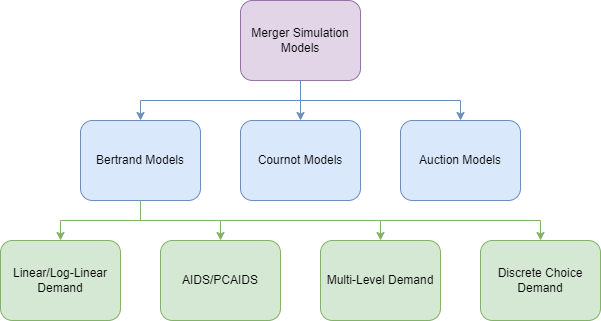
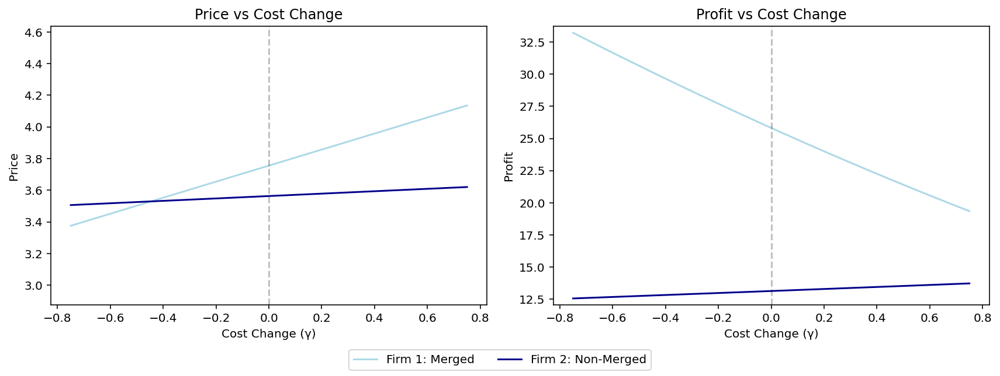
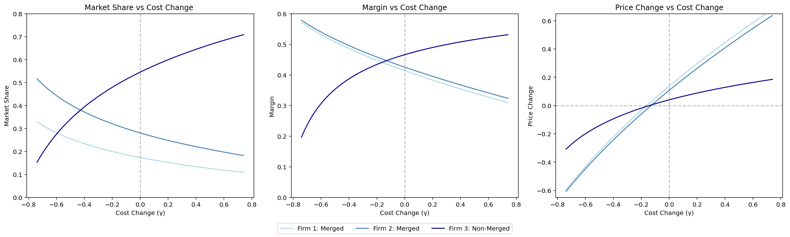

This note serves as an introductory guide to merger simulation techniques, written up as part of my undergraduate IO studies. The aim is to briefly outline the development of thought in this field, and replicate the results of several seminal papers step by step. 

Merger simulations are one of many approaches to forecasting the unilateral effects of a merger. At a high level, merger simulations work by first imposing a form of competition, then calibrating the *structural parameters* of the relevant theoretical model using pre-merger data. This is to say, parameters are specified in such a way that the moments implied by the model match the empirical moments (elasticities, market shares etc.) pre-merger. Under the assumption that these parameters remain unchanged, the model is then applied to any number of counterfactuals to predict price changes.

Before starting, it is important to keep the following disclaimer in mind. As 'scientific' as these approaches may seem, these models (and economists more generally!) are often wrong. Modelling is never entirely comprehensive, and even if it were, the future is not deterministic. However, having a structured approach to such problems, rather than relying solely on intuition, allows others to replicate, interpret, and further our understanding. It is crucial to pay attention to the assumptions made at every step and the many ways they might be broken.

To begin, it is useful to consider a high-level view on the world of merger simulations, and the many approaches available to us. A great place to start is the following categorisation, courtesy of [Budzinksi and Ruhmer (2009)](https://academic.oup.com/jcle/article-abstract/6/2/277/906293). At the first stage, models are classified according to the assumed form of competition that best describes the market. That is, whether competition is in prices, quantities or through an auction mechanism. At the second level of classification, the most common model classification - Bertrand – is split with respect to the demand system. The figure below illustrates this categorisation scheme.



The remainder of this note takes each category in turn, providing background, deriving key theoretical results, and replicating seminal empirical work.

- [Episode I: Linear Demand](#episode--the-phantom-elasticities)
    - [Model Setup](#model-setup)
    - [Analysis](#analysis)
    - [Appendix](#appendix)
- [Episode II: PCAIDS](#episode-iia-attack-of-the-shares)
    - [Assumptions](#assumptions)
    - [Model Setup](#model-setup-1)
    - [Analysis](#analysis-1)
    - [Appendix](#appendix-1)
- [Episode III – Multi-Level Demand](#episode-iii-revenge-of-the-bottoms)
- [Episode IV – Logit](#episode-100-a-binary-hope)
- [Episode V – Cournot Models](#episode--quantity-setting-strikes-back)
- [Episode VI – Auction Models](#episode-v_i-return-of-micro-theory)

## Episode \\: The Phantom Elasticities
This first note covers the most simple of demand structures: linear demand. Credit for this section goes to [Davis(2006)](https://www.biicl.org/files/2757_peter_davis_-_coordinated_effects_merger_simulation_with_linear_demands.pdf).
### Model Setup
The demand for good $k \in \{1, \dots, J\} \equiv \mathcal{J} $ demand is written as a linear function of the prices of all the goods in the market: 
```math
D_k(p_1, \dots, p_N) = 
\begin{cases}
    a_k + \sum_{j=1}^{J}b_{kj}p_j & \text{if } a_k + \sum_{j=1}^{J}b_{kj}p_j \geq 0 \\
    0 & \text{otherwise}
\end{cases}
```
with demand intercept parameter $a_k$ and slope parameter $b_{ij}$ describing the change in demand for product $k$ when good $j$'s price increases by 1 unit. 
### Analysis

```python
import numpy as np
```
We now consider the pricing game, wherein each firm $i$ produces a subset of the available products, $\mathcal{J}_i \subseteq \mathcal{J}$, and choses the prices of these products to maximise its profits. Note at this point that the set $\mathcal{J}_i$ is pre-specified and considered fixed; it is not part of the optimisation problem. Consider the maximisation:
```math
\max_{p_j} \sum_{j \in \mathcal{J_i}} (p_j-c_j)D_j(\mathbf{p}) \quad \text{s.t.} \quad p_j \geq 0 \quad \forall j \in \mathcal{J_i}
```
where $\mathbf{p} = (p_1, \dots, p_N)$ and $c_j$ is the marginal cost of product $j$, assumed constant. In the empirical literature it is common for us to assume that all goods are sold in positive quantities and with positive prices (as such the constraints do not bind in equilibrium). For this reason, consider the first order conditions to the unconstrained problem: 
```math
D_k(\mathbf{p}) + \sum_{j \in \mathcal{J_i}} \frac{\partial D_j(\mathbf{p})}{\partial p_k} (p_j - c_j) = 0, \quad \forall k \in \mathcal{J_i} \\
\implies  a_k + \sum_{j=1}^J b_{kj}p_j + \sum_{j \in \mathcal{J_i}}b_{jk}(p_j - c_j) = 0, \quad \forall k \in \mathcal{J_i}
```
At this point, it is useful to introduce the 'ownership matrix' to standardise the first order conditions. Specifically, the $J \times J$ matrix $\Delta$, with $j,k^{th}$ element:
```math
\Delta_{kj} = 
\begin{cases}
    1 & \text{if $j, k$ produced by same firm} \\
    0 & \text{otherwise}
\end{cases}
```
where, by construction $\Delta_{kj} = \Delta_{jk}$ for all $j,k \in \mathcal{J}$. Changing the ownership structure in unilateral effects merger simulations reduces to solely changing this indicator matrix. Using this new matrix we can reconstruct the first order condition by summing over all products:
```math
  a_k + \sum_{j=1}^J b_{kj}p_j + \sum_{j=1}^J \Delta_{jk} b_{jk}(p_j - c_j) = 0 \quad \forall k \in \mathcal{J_i}
```
Note that there is one of these first order conditions for each $k \in \mathcal{J_i}$. Since every product is owned by some firm, we obtain a total of $J$ first order conditions - one for each product. We can then stack up these conditions as follows. We first define the matrices $\mathbf{a}$ and $\mathbf{B}$ as vectors of demand coefficients as follows:

```math
\underbrace{\mathbf{a}}_{J \times 1} = 
\begin{pmatrix}
a_1 \\
\vdots \\
a_J
\end{pmatrix}

\quad

\underbrace{\mathbf{B}}_{J \times J} = 
\begin{pmatrix}
b_{11} & \cdots & b_{j1}& \cdots & b_{J1} \\
\vdots & & \vdots & & \vdots \\
b_{1k} & \cdots& b_{jk} & \cdots & b_{Jk} \\
\vdots & & \vdots & & \vdots \\
b_{1J} & \cdots& b_{jJ} & \cdots & b_{JJ}
\end{pmatrix}
```

It is also useful to define the Hadamard (or element-by-element) product of $\Delta$ and $\mathbf{B}$:
```math
\underbrace{ \Delta \odot \mathbf{B}}_{J \times J} = 
\begin{pmatrix}
\Delta_{11}b_{11} & \cdots & \Delta_{j1}b_{j1}& \cdots & \Delta_{J1}b_{J1} \\
\vdots & & \vdots & & \vdots \\
\Delta_{1k}b_{1k} & \cdots& \Delta_{jk}b_{jk} & \cdots & \Delta_{Jk}b_{Jk} \\
\vdots & & \vdots & & \vdots \\
\Delta_{1J}b_{1J} & \cdots& \Delta_{jJ}b_{jJ} & \cdots & \Delta_{JJ}b_{JJ}
\end{pmatrix}
```
This convenient notation allows us to rewrite the demand system for all goods as $D(\mathbf{p}) = \mathbf{a} + \mathbf{B^Tp}$, and the FOCs can be written as $\mathbf{0}  = \mathbf{a}+ \mathbf{B^Tp} + (\Delta \odot \mathbf{B})(\mathbf{p-c})$.

```python
D_p = a + B.T @ price
```

The solution to this set of equations is the Nash equilibrium vector of prices, $\mathbf{p^*} = (p_1^*,\dots, p_J^*)$ since each firm is choosing the prices of its products to maximise its profits given the prices charged by other firms. Rearranging this: 
```math
\begin{align*}
\mathbf{0}  &= \mathbf{a}+ \mathbf{B^Tp} + (\Delta \odot \mathbf{B})(\mathbf{p-c}) \\
\implies 
(\mathbf{B^T} + (\Delta \odot \mathbf{B}))\mathbf{p} &= -\mathbf{a} +(\Delta \odot \mathbf{B})\mathbf{c} \\
\implies 
\mathbf{p^*} &= (\mathbf{B^T} + (\Delta \odot \mathbf{B}))^{-1}(-\mathbf{a} +(\Delta \odot \mathbf{B})\mathbf{c})
\end{align*}
```

```python
Delta_hadamard_B = delta * B
inverse_term = np.linalg.inv(B.T + Delta_hadamard_B)
price = inverse_term @ (-a + (Delta_hadamard_B @ c))
```
The convenience of linear demand, is that all objects of interest can be computed easily for a given ownership structure. For example, once the nash prices are computed, demand is simply given by: $D(\mathbf{p}) = \mathbf{a} + \mathbf{B^Tp^*}$ and profits derived from each product are $(\mathbf{p^*-c}) \odot D(\mathbf{p})$. The profits of each firm can then be calculated by summing across the owned products (the corresponding row of the ownership matrix): $\Pi_i(\mathbf{p^*}) = \Delta^T_j ((\mathbf{p^*-c}) \odot D(\mathbf{p}))$

```python
profits = delta.T @ ((price - c) * D_p)
```

Now it's time to simulate! 
Consider a firm $i$ with a set of products $\mathcal{J_i^{pre}}$ and marginal cost $c_j^{pre}$ $\forall j \in \mathcal{J_i^{pre}}$. Post merger the corresponding values are given by $\mathcal{J_i^{post}}$ and marginal cost $c_j^{post}$. These ownership structures are captured in the matrix $\Delta$, so a unilateral effects simulation with linear demand amounts to calculating the NE prices in each case: 
```math
\mathbf{p^{pre}} = (\mathbf{B^T} + (\Delta^{pre} \odot \mathbf{B}))^{-1}(-\mathbf{a} +(\Delta^{pre} \odot \mathbf{B})\mathbf{c}^{pre}) \\
\mathbf{p^{post}} = (\mathbf{B^T} + (\Delta^{post} \odot \mathbf{B}))^{-1}(-\mathbf{a} +(\Delta^{post} \odot \mathbf{B})\mathbf{c}^{post})
```
Oftentimes data on marginal costs will not be available. To circumvent this issue, we can make the assumption of profit maxing pre-merger and extract the original cost. We recreate the analysis using this approach in appendix [A1: Cost Estimation](#a1-cost-estimation).

Consider a market with 3 firms $j = 1,2,3$, with each firm owning one product pre-merger. This means the ownership matrix is the $3\times3$ identity matrix. For now we also assume that no efficiencies result from the merger, such that $c^{pre}=c^{post}=1$. 
```python
delta = np.identity(3)
c = np.full((3, 1), 1)
```
Suppose further that the linear demand structure for the first product is given by:
```math
q_1 = 10 - 2p_1 + 0.3p_2 + 0.3p_3
```
and the others for $j=2,3$ are symmetrically defined with the coefficient -2 on own price, and the coefficients 0.3 on rival products' prices. In practice we don't know the values of these parameters and must calibrate these as well, this is a problem considered in later sections.

```python
a = np.full((3, 1), 10)
B = np.full((3, 3), 0.3)
np.fill_diagonal(B, -2)
```
Running our code from earlier now allows us to compute both the Nash equilibrium prices and profits in this environment. The table below describes prices (with profits in brackets) under several ownership structures: firstly where each firm owns one good, secondly when firms 1 and 3 merge (into firm 1), and thirdly a pure monopolist.

| Firm    | (1,1,1)         | (2,1)         | (3)           |
| --------| -------         | -----         | -------       |
| Firm 1  | $3.53 (12.80)$  | $3.76 (25.82)$| $4.07 (39.62)$|
| Firm 2  | $3.53 (12.80)$  | $3.56 (13.14)$|               |
| Firm 3  | $3.53 (12.80)$  |               |               |

#### Comparative Statics: Cost Savings
We might care about what level of cost saving is needed for a merger to result in a price increase. To do this, it is useful to define the cost change paramter as follows: $\gamma_i = \frac{c_i^{post}-c_i^{pre}}{c_i^{pre}}$. This parameter captures the degree of efficiency gain, with a lower value of $\gamma$ reflecting greater cost savings. We vary the parameter $\gamma_i$ between $-0.75$ and $0.75$ and simulate a merger between firms 1 and 3 as above, i.e. the (2,1) structure in the table above. The resulting prices and profits are plotted below. 



Note that the newly merged firm sells both products 1 and 3 at the same price, since the problem is symmetric in all goods. 

As the cost savings increase (and the efficiency term becomes negative) the price change decreases until the merger eventually results in a decrease in price. This is to say, that even in the case of efficiencies, price decreases do not necessarily follow. Absent cost savings the merger increases prices, thus a large cost saving is required for the post-merger price to fall.

### Appendix

#### A1: Cost estimation
Given the observed pre-merger prices $\mathbf{p}^{pre}$ and the ownership matrix $\Delta^{pre}$, we may solve the first order conditions for pre-merger marginal costs:

```math
\mathbf{c^{pre}} = (\Delta^{pre} \odot \mathbf{B})^{-1} (\mathbf{a}+(\mathbf{B^T} + (\Delta \odot \mathbf{B}))\mathbf{p^{pre}})
```
For example, if we have the simplest case of independent goods each owned by a seperate firm ($\mathbf{B}$ and $\Delta$ are diagonal), and for simplicity $\mathbf{a = 1}$:

```math
\begin{align*}
\mathbf{c^{pre}} &= (\Delta^{pre} \odot \mathbf{B})^{-1} (\mathbf{a}+(\mathbf{B^T} + (\Delta \odot \mathbf{B}))\mathbf{p^{pre}}) \\
&= \mathbf{I^{-1}(1}+2\mathbf{Ip^{pre}}) \\
&= \mathbf{1+2p^{pre}}
\end{align*}
```
For example, if prices pre-merger are 1 for each firm, the implied cost would be 3 for each firm. We can then plug this estimate into our formulas above, and proceed with simulation as normal.
## Episode II(A): Attack of the Shares
This note covers a simple PCAIDS model, following the original paper by [Epstein and Rubinfield (2001)](https://escholarship.org/uc/item/2sq9s8c8).

Proportionality-Calibrated AIDS (PCAIDS) is an attempt to reduce the reliance on vast amounts of data or circumvent the estimation problems of standard AIDS. PCAIDS requires neither scanner data nor pre-merger prices. It only requires information on:
1. market shares,
2. the industry price elasticity, and
3. the price elasticity for one brand in the market.

### Assumptions
**(PC1) Proportionality**: If the price of one brand increases, consumers will switch to the competing brands in proportion to market shares.

**(PC2) Homogeneity**: If all firms in the market raise their price by the same percentage, market shares are unaffected.

**(PC3) Adding-up**: Market shares of all firms in the market sum to 1.

The real punch of PCAIDS comes from *proportionality*. The logic is simple: the share lost as a result of a price increase is is allocated to the other firms in proportion to their respective shares. In effect, the market shares define probabilities of making incremental sales for each of the competitors. This is equivalent to the assumption of "Irrelevance of Independent Alternatives" (IIA) that underlies the logit model. 

This assumption is likely to be reliable when applied to markets with limited product differentiation, or when merger brands are not unusually close (or distant) in terms of their attributes and substitutability.

### Model Setup
The setup is as in AIDS, firm *i*'s demand in this model is a function of the natural logarithms of the prices of all brands in the relevant market:
```math
s_i = a_i + b_{ii} \ln(p_i) + b_{ij} \ln(p_j) + b_{ik} \ln(p_k)
```
Thus the demand system for our example market is:
```math
\begin{pmatrix}
s_1 \\
s_2 \\
s_3
\end{pmatrix}
=
\begin{pmatrix}
a_1 \\
a_2 \\
a_3
\end{pmatrix}
+
\begin{pmatrix}
b_{11} & b_{12} & b_{13} \\
b_{21} & b_{22} & b_{23} \\
b_{31} & b_{32} & b_{33}
\end{pmatrix}
\begin{pmatrix}
\ln(p_1) \\
\ln(p_2) \\
\ln(p_3)
\end{pmatrix}

```
Firm *i*'s market share is defined as $s_i = \frac{p_i q_i}{PQ}$ , where $p_i$ denotes *i*'s price, $q_i$ denotes *i*'s quantity, $Q$ total market output, and $P$ the aggregate industry price index. We assume a logarithmic price aggregator; the price index is given by: $\ln(P) = \sum_{i=1}^3 s_i \ln(p_i)$.

The own-coefficients $b_{ii}$ specify the effect of each firm's own price on its share; we expect these to have negative signs (since an increase in a firms price should reduce demand for their product holding all else equal). The $b_{ij}$'s specify the efects of the prices of other firms on each brand's share. We expect these cross effects to be positive (assuming the products are substitutes).

### Analysis
For illustration, we first replicate the example in table 1 on page 895 of [Epstein and Rubinfield(2001)](https://escholarship.org/uc/item/2sq9s8c8), then use this calibrated model to simulate a merger between firms 1 and 2.

```python
from math import log
from scipy import optimize
```

We store firms' market shares and elasticities in dictionaries, and can refer to firm *i*'s share as <code>market_share[firm*i*]</code>. Recall that the only parameters needed for PCAIDS are: market shares, price elasticity for one firm, and the market elasticity. In this case suppose we know the elasticity of firm 1. To simulate markets with different setups, simply alter the following parameters:
```python
firms = ['firm1', 'firm2', 'firm3']
market_share = {'firm1': 0.2,
                'firm2': 0.3,
                'firm3': 0.5}
elasticity = {('firm1', 'firm1'): -3.0}
market_elasticity = -1
```

As proved in the paper, we can compute the own price coefficient of the firm for which we the have own price elasticity (here firm 1):
```math
b_{11} = s_1(\epsilon_{11} +1 -s_1(\epsilon+1))
```
We create our coefficient dictionary, and compute $b_{11}$ using the above formula and parameter values.
```python
coefficient = {}
coefficient['firm1', 'firm1'] = market_share['firm1'] * (elasticity['firm1', 'firm1'] + 1 - market_share['firm1'] * (market_elasticity + 1))
```
Proportionality implies that all remaining own-effect coefficients can be determined as simple multiples of $b_{11}$ (proof in paper):
```math
b_{ii} = \frac{s_i}{1-s_1} \cdot \frac{1-s_i}{s_1} \cdot b_{11}
```
This allows us to update the coefficient dictionary with all own-coefficients.
```python
coefficient.update({
    (firm, firm): market_share[firm] * (1 - market_share[firm]) / (market_share['firm1'] * (1 - market_share['firm1'])) * coefficient['firm1', 'firm1']
    for firm in firms
})
```

Proportionality further gives us all remaining cross-effects. Consider the cross-effects of $p_1$ on the shares of firms 2 and 3, given by $b_{21}, b_{31}$. With proportionality, sales are diverted in proportion to market shares, that is:
```math
b_{21} = - \frac{s_2}{s_2+s_3} \cdot b_{11}, \quad b_{31} = - \frac{s_3}{s_2+s_3} \cdot b_{11}
```
The same result holds for other prices:
```math
b_{ij} = \frac{s_i}{\sum_{k != i} s_k} \cdot b_{jj}
```
Implementing this allows us to fill in the remainder of the coefficients
```python
coefficient.update({
    (one_firm, other_firm): -market_share[one_firm] / (1 - market_share[other_firm]) * coefficient[other_firm, other_firm]
    for one_firm in firms for other_firm in firms if one_firm != other_firm
})
```

| Price coefficients    | $p_1$   | $p_2$     | $p_3$   |
| --------              | ------- | -----     | ------- |
| Firm 1                | $-0.4$  | $0.15$    | $0.25$   |
| Firm 2                | $0.15$  | $-0.525$  | $0.375$ |
| Firm 3                | $0.25$  | $0.375$   | $-0.625$|

Further, we can now express the elasticities uniquely in terms of the set parameters and coefficients. We are first able to derive the elasticities (see [A1: Elasticities](#a1-elasticities)):
```math
\epsilon_{i,j} = -\delta_{ij} + \frac{b_{ij}}{s_i} + s_j (\epsilon + 1)
```
where $\delta_{ij}$ is the Kronecker delta.

Since we now know every coefficient, this allows us to compute all elasticities, despite only starting with 5 parameters!
```python
elasticity.update({
    (one_firm, other_firm): (
        (-1 + coefficient[one_firm, one_firm] / market_share[one_firm] + market_share[one_firm] * (market_elasticity + 1))
        if one_firm == other_firm
        else (coefficient[one_firm, other_firm] / market_share[one_firm] + market_share[other_firm] * (market_elasticity + 1))
    )
    for one_firm in firms for other_firm in firms
})
```

| Cross Elasticities| Firm 1   | Firm 2     | Firm 3   |
| --------              | ------- | -----     | ------- |
| Firm 1                | $-3.0$  | $0.75$    | $1.25$   |
| Firm 2                | $0.5$  | $-2.75$  | $1.25$ |
| Firm 3                | $0.5$  | $0.75$   | $-2.25$|


Now we know the parameters, we can run the simulation! First some Micro 101; a price setting firm solves the following:
```math
\pi_i = p_i q_i(p_i, p_{-i}) - C_i(q_i(p_i,p_{-i})) \\
\frac{\partial \pi_i}{\partial p_i} = q_i(p_i, p_{-i}) + p_i \frac{\partial q_i}{\partial p_i} - \frac{\partial C}{\partial q_i} \frac{\partial q_i}{\partial p_i} \\
\implies  0 = q_i + \frac{\partial q_i}{\partial p_i}\left(p_i -\frac{\partial C}{\partial q_i} \right) \\
\frac{p_i - \frac{\partial C}{\partial q_i}}{p_i} = - \frac{q_i}{p_i}\frac{\partial p_i}{\partial q_i}
```
$\frac{\partial C}{\partial q_i}$ is the incremental cost of producing an extra unit, which we define as $c_i$. We can define the margin as $\frac{markup}{price}$ or equivalently $\mu_i := \frac{p_i - c_i}{p_i}$:

```math
\implies \mu_i = - \epsilon_{ii}^{-1}
```

```python
margin = {firm: -1 / elasticity[firm, firm] for firm in firms}
```
Before continuing it is useful to define the efficiency gain as $\gamma_i = \frac{c_i^p-c_i}{c_i}$
that is, the percentage change in $i$'s costs due to the merger. Confusingly a larger value of this efficiency term corresponds to a more efficient merged firm (i.e. when negative, costs fall post-merger).

We want to specify the ex-post merger outcome in terms of market shares: $s_j^p$, price cost margins: $\mu_j^p$ and price change $\delta_j = \frac{p_j^p-p_j}{p_j}$. Our aim is to find a system we can solve for these parameters. We consider a baseline without efficiency gains for now, and initialise dictionaries for post-merger parameters:

```python
merging_firms = ['firm1', 'firm2']
nonmerging_firms = list(set(firms) - {'firm1', 'firm2'})
efficiency_gains = {firm: 0 for firm in firms}

post_marketshare, post_elasticity, post_margin, price_change = {}, {}, {}, {}
```

With 3 unknown parameters across 3 firms, we need a system of 9 equations. Denoting by $M$ the set of merging firms (here firm 1 and firm 2):
```math
\begin{align}
s^p_i &= s_i + \sum_{j}b_{ij}\log(1+\delta_j) \quad \forall i,j\\
\mu^p_i &= 1 - \frac{1+\gamma_i}{1+\delta_i}(1-\mu_i) \quad \forall i \\
\mu^p_i &=  - \frac{1}{\epsilon_{ii}^p} \quad \forall i \notin M \\
s_i^p &= -\sum_{j}\epsilon_{ji}^p s_j^p\mu_j^p \quad \forall i,j \in M
\end{align}
```
We've already derived (3), see [A2: Ex-post Equations](#a2-ex-post-equations) for a derivation of (1), (2) and (4). All we need now is the post-merger cross elasticities of the merging firms with each other, and the own price elasticity of the non-merging firm. Luckily we derived these already!

```math
\begin{align}
\epsilon_{ii}^p &= -1 + \frac{b_{ii}}{s_i^p} + s^p_i (\epsilon +1) \\
\epsilon_{ij}^p &= \frac{b_{ij}}{s^p_j} + s_j(\epsilon+1)
\end{align}
```
This gives us 12 equations in terms of 12 unknowns, the 9 from above and the 3 elasticities. We form a list of equations such that if each element equals zero all equations are satisfied and we find the post-merger equilibrium.

```python
def vector_function(post_marketshare, post_elasticity, post_margin, price_change):
    eq = []
    # Equations for all firms
    for firm in firms:
        # Equation (1)
        eq.append(
            post_marketshare[firm] - (market_share[firm] + sum(coefficient[firm, other_firm] * log(1 + price_change[other_firm]) for other_firm in firms))
        )
        # Equation (2)
        eq.append(
            post_margin[firm] - (1 - (1 + efficiency_gains[firm]) / (1 + price_change[firm]) * (1 - margin[firm]))
        )
    # Equations for non-merging firms
    for firm in nonmerging_firms:
        # Equation (3)
        eq.append(
            post_margin[firm] + 1 / post_elasticity[firm, firm]
        )
        # Equation (5)
        eq.append(
            post_elasticity[firm, firm] - (-1 + coefficient[firm, firm] / post_marketshare[firm] + post_marketshare[firm] * (market_elasticity + 1))
        )
    # Equations for merging firms
    for firm in merging_firms:
        # Equation (4)
        eq.append(
            post_marketshare[firm] + sum(post_elasticity[other_firm, firm] * post_marketshare[other_firm] * post_margin[other_firm] for other_firm in merging_firms)
        )
        # Equation (6)
        for other_firm in merging_firms:
            eq.append(post_elasticity[firm, other_firm] - (-(firm == other_firm) + coefficient[firm, other_firm] / post_marketshare[firm] + post_marketshare[other_firm] * (market_elasticity + 1))
            )
    return eq
```
The SciPy solver takes as input a vector $x$, not a collection of dictionaries. Thus we need to define a 'wrapper' function to create vector $x$ from values in the dictionaries. Once we have the solution, we 'unwrap' it into values for our dictionaries.
```python
def wrapper_function(x):
    count = 0
    for d in [post_marketshare, post_margin, price_change]:
        for firm in firms:
            d[firm] = x[count]
            count += 1
    for firm in nonmerging_firms:
        post_elasticity[firm, firm] = x[count]
        count += 1
    for firm in merging_firms:
        for other_firm in merging_firms:
            post_elasticity[firm, other_firm] = x[count]
            count += 1
    return vector_function(post_marketshare, post_elasticity, post_margin, price_change)

def unwrap(x):
    count = 0
    for d in [post_marketshare, post_margin, price_change]:
        for firm in firms:
            d[firm] = x[count]
            count += 1
    for firm in nonmerging_firms:
        post_elasticity[firm, firm] = x[count]
        count += 1
    for firm in merging_firms:
        for other_firm in merging_firms:
            post_elasticity[firm, other_firm] = x[count]
            count += 1
    return [post_marketshare, post_elasticity, post_margin, price_change]
```
We use the pre-merger values as our initial conditions:
```python
def initial_value(): # initial value based on before merger values
    x = []
    for dict in [market_share,margin]:
        for firm in sorted(firms):
            x.append(dict[firm])
    for firm in sorted(firms):
        x.append(0.0) # price change
    for firm in sorted(nonmerging_firms):
        x.append(elasticity[firm, firm])
    for firm in sorted(merging_firms):
        for other_firm in sorted(merging_firms):
            x.append(elasticity[firm, other_firm])
    return x
```
We solve this system using the SciPy function <code>fsolve</code>, to find the roots of the system specified in <code>vector_function</code>. That is, the point where all equations hold specifying the post-merger equilibrium.
```python
outcome = unwrap(optimize.fsolve(wrapper_function, initial_value()))
```

| Post-merger           | Market Share  | Margin    | Price Increase   |
| --------              | ------- | -----     | ------- |
| Firm 1                | $0.174$  | $0.414$    | $0.138$   |
| Firm 2                | $0.281$  | $0.425$  | $0.108$ |
| Firm 3                | $0.546$  | $0.466$   | $0.041$|

As expected, a merger between firms producing subsitutes with no efficiency gains leads to higher prices for all firms. The market share of the non-merging firm increases due to the merger as prices increase more for the merging firms. However, what would happen if there were cost savings?
#### Comparative Statics: Cost Savings
We vary the parameter $\gamma_i$ between $-0.75$ and $0.75$ and run the simulation. The resulting shares, margins and price changes are plotted below.



As the cost savings increase (and the efficiency term becomes negative) the price change decreases until the merger eventually results in a decrease in price. Note that even if there are efficiencies, this does not imply a price decrease. As shown in the previous section, absent cost savings the merger increases prices, thus a large cost saving is required for the post-merger price to outweigh this change.
### Appendix
#### A1: Elasticities
Recall that the own price elasticity of a good is defined as the proportional change in demand resulting from a proportional change in price:
```math
\begin{align*}
\epsilon_{i,i} &= \frac{\partial q_i}{\partial p_i} \frac{p_i}{q_i} \\
&= \frac{\partial}{\partial p_i} \left(\frac{s_i  PQ}{p_i}\right) \cdot \frac{p_i}{q_i} \\
&= \left(\frac{-s_iPQ+p_i\left(PQ \cdot \frac{\partial s_i}{\partial p_i}+s_i\cdot \frac{\partial PQ}{\partial p_i} \right)}{p_i^2} \right)\cdot \frac{p_i}{q_i} \\
\end{align*}
```
There are a few simplifications we can make here. Firstly note that from the definition of market shares, we can write $s_iPQ = p_i q_i$. Secondly, using the AIDS demand structure, we can differentiate the own price term $b_{ii} \ln(p_i)$ to get $\frac{\partial s_i}{\partial p_i} = \frac{b_{ii}}{p_i}$. Finally we can substitute in the definition of market shares: $s_i = \frac{p_i q_i}{PQ}$:

```math
\begin{align*}
\epsilon_{i,i} &= \left(-\frac{p_iq_i}{p_i^2}+\frac{\left(PQ \cdot\frac{b_{ii}}{p_i}+\frac{p_i q_i}{PQ}\cdot \frac{\partial PQ}{\partial p_i} \right)}{p_i} \right)\cdot \frac{p_i}{q_i} \\
&= \left(-\frac{q_i}{p_i}+\frac{PQ}{p_i}\cdot \frac{b_{ii}}{p_i} +\frac{q_i}{\partial p_i} \cdot \frac{\partial PQ}{PQ}\right)\cdot \frac{p_i}{q_i} \\
&= -1+ \frac{PQ}{p_iq_i} \cdot b_{ii} + \frac{p_i}{\partial p_i} \cdot \frac{\partial PQ}{PQ} \\ 
&= -1+ \frac{b_{ii}}{s_i} + \frac{p_i}{\partial p_i} \cdot \left(\frac{\partial P}{P} +\frac{\partial Q}{Q} \right) \\ 
&= -1+ \frac{b_{ii}}{s_i} + \frac{p_i}{\partial p_i} \cdot \frac{\partial P}{P} (1 +\epsilon) \\ 
\end{align*}
```
Finally we notice from the definition of the price index that $\frac{\partial(\ln P)}{\partial p_i} = \frac{s_i}{p_i}$, applying the chain rule gives us $\frac{\partial P}{\partial p_i} = s_i\cdot\frac{P}{p_i}$ which yields:
```math
\epsilon_{i,i} = -1+ \frac{b_{ii}}{s_i} + s_i (1 +\epsilon) \\ 
```
The derivation is similar for the cross-elasticities:
```math
\epsilon_{i,j} = \frac{b_{ij}}{s_i} + s_j (1 +\epsilon) \\ 
```

#### A2: Ex-post Equations
**(1)** 
We first write the share equations from our demand system both pre and post merger, then take the difference.
```math
\begin{align*}
s_i &= a_i + b_{ii}\ln(p_i) + b_{ij} \ln(p_j) + b_{ik}\ln(p_k)\\
s_i^p &= a_i + b_{ii}\ln(p_i^p) + b_{ij} \ln(p_j^p) + b_{ik}\ln(p_k^p) \\
s_i^p - s_i &= b_{ii}\ln\left(\frac{p_i^p}{p_i}\right) + b_{ij} \ln\left(\frac{p_j^p}{p_j}\right) + b_{ik}\ln\left(\frac{p_k^p}{p_k}\right)
\end{align*}
```
Using our definition of price change, we know: $\delta_i = \frac{p_i^p-p_i}{p_i} = \frac{p_i^p}{p_i} - 1$. Thus:
```math
\begin{align*}
s_i^p - s_i &= b_{ii}\ln(1+\delta_i) + b_{ij} \ln(1+\delta_j) + b_{ik}\ln(1+\delta_k) \\
\implies s_i^p &= s_i + \sum_{j}b_{ij}\log(1+\delta_j) \quad \forall i,j
\end{align*}
```
**(2)** 
Recall first the definitions of $\mu_i$, $\gamma_i$ and $\delta_i$. Manipulating these gives us:
```math
\begin{align*}
\mu_i = \frac{p_i-c_i}{p_i} &\implies c_i = (1-\mu_i)p_i \\
\gamma_i = \frac{c^p_i-c_i}{c_i} &\implies c_i^p = (1+\gamma_i)c_i\\
\delta_i = \frac{p^p_i-p_i}{p_i} & \implies p_i^p = (1+\delta_i)p_i
\end{align*}
```
Using now the definition of $\mu_i^p$ and substituting in the above, gives:
```math
\begin{align*}
\mu_i^p &= \frac{p_i^p-c^p_i}{p_i^p} \\
&= \frac{(1+\delta_i)p_i-(1+\gamma_i)(1-\mu_i)p_i}{ (1+\delta_i)p_i}\\
&= 1 - \frac{1+\gamma_i}{1+\delta_i}(1-\mu_i) \quad \forall i

\end{align*}
```
**(4)** 
Consider the profit maximisation problem of the newly merged firm $jk$, and we examine the FOC wrt $p_j$
```math
\begin{align*}
\pi^p_{jk} &= q^p_k(p^p_k-c^p_k) + q^p_j(p^p_j-c^p_j) \\
\frac{\partial \pi^p_{jk}}{\partial{p^p_j}} &= \frac{\partial q^p_k}{\partial{p^p_j}}(p^p_k-c^p_k) + q_j^p + \frac{\partial q^p_j}{\partial{p^p_j}}(p^p_j-c^p_j) := 0\\
0 &= \frac{\partial q^p_k}{\partial{p^p_j}}p^p_k\mu_k + q_j^p + \frac{\partial q^p_j}{\partial{p^p_j}}p_j^p\mu_j^p\\
&= \epsilon_{kj}^pq^p_k\frac{p^p_k}{p^p_j}\mu_k^p + q_j^p + \epsilon_{jj}^pq^p_j\mu^p_j
\end{align*}
```
We can simplify by multiplying through by $\frac{p^p_j}{P^pQ^p}$, giving:
```math
\begin{align*}
0 &= \epsilon_{kj}^p\frac{q^p_kp^p_k}{P^pQ^p}\mu_k^p + \frac{q^p_jp^p_j}{P^pQ^p} + \epsilon_{jj}^p\frac{q^p_jp^p_j}{P^pQ^p}\mu^p_j\\
&= \epsilon_{kj}^ps^p_k\mu_k^p + s^p_j + \epsilon_{jj}^ps^p_j\mu^p_j\\
\implies s^p_j  &= -\sum_{j}\epsilon_{ji}^p s_j^p\mu_j^p \quad \forall i,j \in M
\end{align*}
```
# WORK IN PROGRESS
## Episode I<span style="font-size: 0.8em;">I</span><span style="font-size: 0.55em;">I</span>: Revenge of the Bottoms
Beer paper
## Episode 100: A Binary Hope
### Flat Logit
### Nested Logit
### Random Coefficients Logit

## Episode ◡: Quantity-Setting Strikes Back

## Episode v_i: Return of Micro Theory

